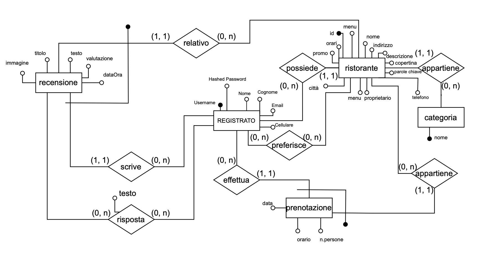

# ***GustoInRete***

Indice:
- [Installazione](#inst)
- [Start](#start)
- [Accesso al sito](#access)
- [Struttura del progetto](#prog)
- [Funzionalità](#func)
- [Video](#vid)

## Installazione
Per avviare il server è necessario prima di tutto installare Node.js. 
Puoi farlo eseguendo il comando: `npm install -g node`

Dopo aver installato Node.js, esegui il comando seguente nel terminale 
per scaricare tutte le dipendenze e librerie: `npm install`

## Start
Per avviare il server, esegui il comando seguente nel terminale: `node app.js`
Per spegnere il server premi i tasti: `CTRL + C` sul terminale.

### Accesso al sito
Per accedere al sito puoi utilizzare le seguenti credenziali:

Cliente:
- Username: `matteobarbieri@gmail.com`
- Password: `Prova.Pass`

Cliente:    
- Username: `BarbiPao`
- Password: `BarbiPao.11`
------------

Ristoratore:    
- Username: `Vale93`
- Password: `Vale93..`

Ristoratore:
- Username: `Violetta`
- Password: `HollyID23!`

## Struttura del progetto

### Database
Il file del database principale si trova nella cartella database con il nome ***GustoInRete.db***. 
Questo database è gestito attraverso il file JavaScript ***db.js***, 
che contiene tutte le funzioni per interagire con i dati.

Di seguito lo schema ER del database:

Nella cartella database è presente anche il database ***sqliteSessions.db***
nel quale sono salvate le informazioni riguardo le sessioni ed i cookies. Questo 
permette di mantenere le informazioni riguardo l'utente durante la sessione anche se il server
viene riavviato, o il browser viene chiuso.

### Routes
Le routes sono situate all'interno della cartella '***routes.js***' 
- ***auth.js:*** Gestisce l’autenticazione degli utenti.
- ***chiSiamo.js:*** Pagina informativa su chi siamo.
- ***iscrizione.js:*** Gestione della registrazione degli utenti.
- ***paginaRistorante.js:*** Dettagli per ogni ristorante.
- ***paginaUtente.js:*** Profilo e gestione delle impostazioni utente.
- ***profilo.js:*** Visualizzazione del profilo utente.
- ***crono.js:*** Storico delle attività dell’utente.
- ***privacyPolicy.js:*** Politiche di privacy.
- ***termini.js:*** Termini e condizioni di utilizzo.
- ***cronoRist.js:*** Storico delle attività per i ristoranti.
- ***risposteRist.js:*** Gestione delle risposte dei ristoranti.

### Views
Le viste del progetto sono memorizzate nella cartella views 
in formato EJS. Questi file vengono elaborati dal server e inviati ai client. 
La cartella partials contiene componenti di visualizzazione riutilizzabili, per evitare la ripetizione di codice.

### Librerie
Per lo sviluppo del progetto sono state utilizzate le librerie trattate nel corso:
- [Express](https://expressjs.com/)
- [EJS](https://ejs.co/)
- [SQLite3](https://www.sqlite.org/)
- [Passport](https://www.passportjs.org/)
- [Bycrypt](https://www.npmjs.com/package/bcrypt)

Inoltre sono state utilizzate delle librerie extra per implementare ulteriori funzionalità, come ad esempio la gestione dei caricamenti di file, animazioni ed altro. Di seguito le librerie:

- [Multer](https://www.npmjs.com/package/multer)
- [Tagify](https://yaireo.github.io/tagify/)
- [AOS](https://michalsnik.github.io/aos/)

## Funzionalità
Il sito permette agli utenti di svolgere diverse attività, suddivise in base al tipo di utente:
### Anonimo
	•	Visualizzare i ristoranti e le recensioni.
	•	Effettuare ricerche di ristoranti per nome o categoria.
    •	Scaricare i Menu dei ristoranti.
    •	Visualizzare le pagine di informazioni del sito (accessibili dal footer).

### Loggato
	•	Accedere e modificare il proprio profilo.
	•	Aggiungere ristoranti ai preferiti.
	•	Scrivere recensioni per i ristoranti (ed eliminarle).
	•	Effettuare prenotazioni nei ristoranti.
    •   Visualizzare la cronologia delle prenotazioni (ed eliminarle) e delle risposte dei ristoratori.
    •   Visualizzare le statistiche del proprio profilo.
    •   Diventare ristoratore aggiungendo il proprio ristorante.
    •   Eliminare il proprio profilo.

### Ristoratore
	•	Modificare le informazioni del proprio ristorante.
	•	Rispondere alle recensioni dei clienti.
	•	Visualizzare le prenotazioni degli utenti al proprio ristorante (ed eliminarle).
    •   Eliminare il proprio ristorante

## Video
***Video di presentazione*** -> 
